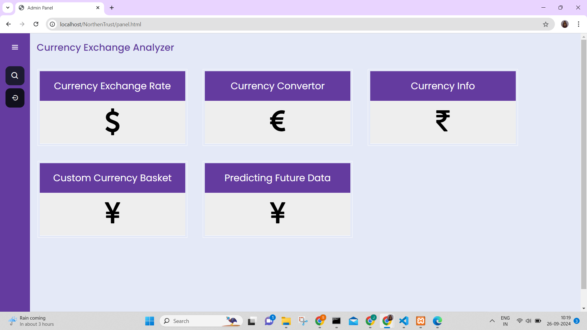
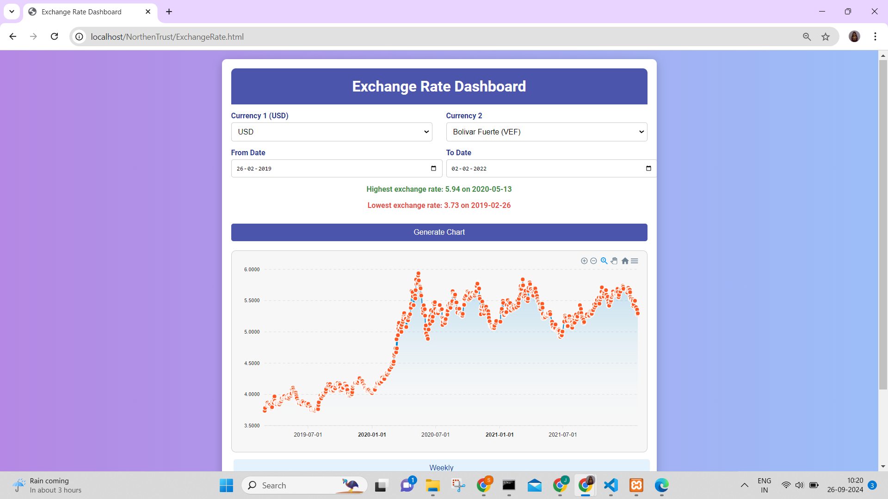
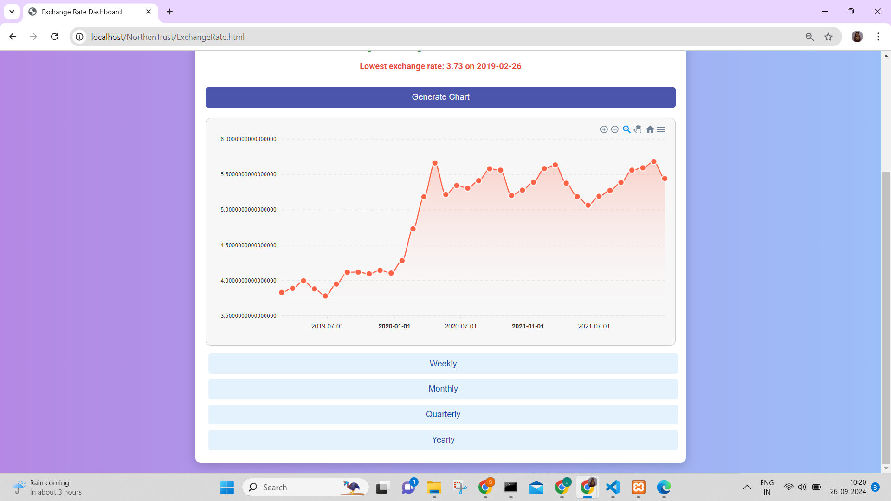
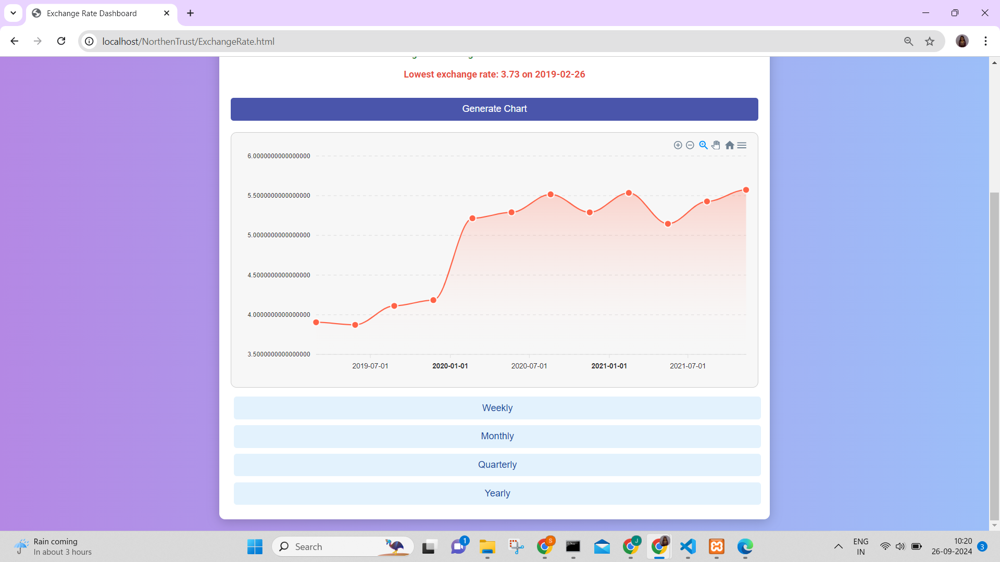
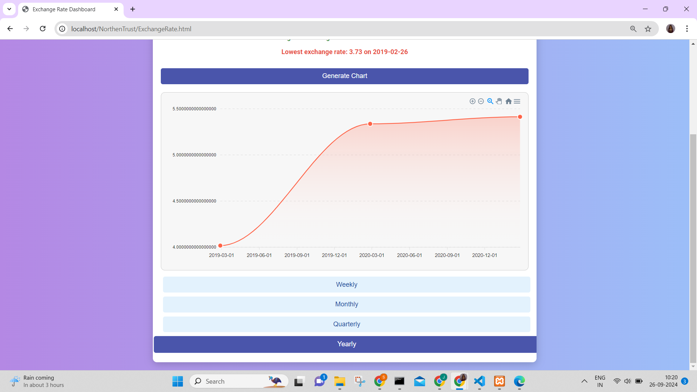
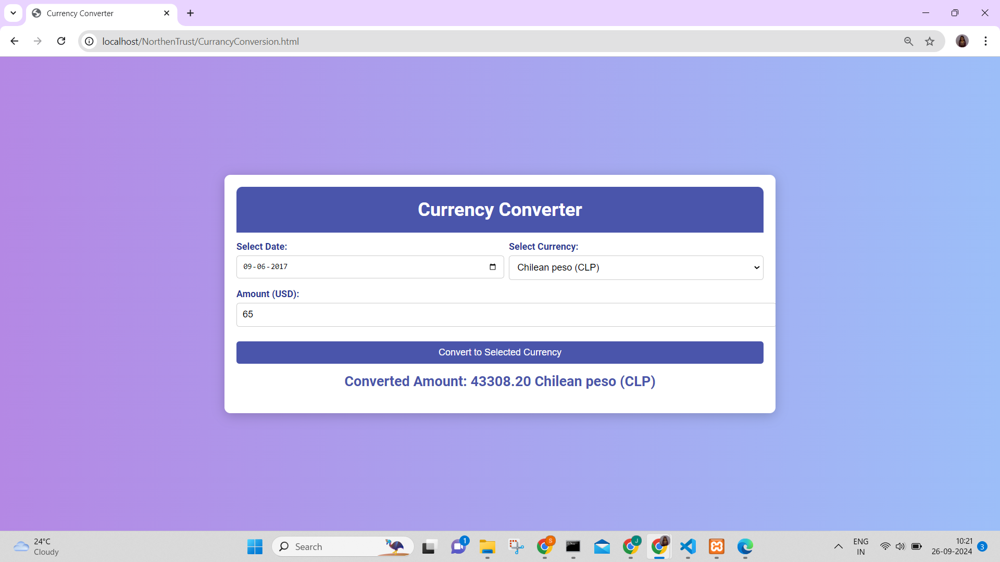
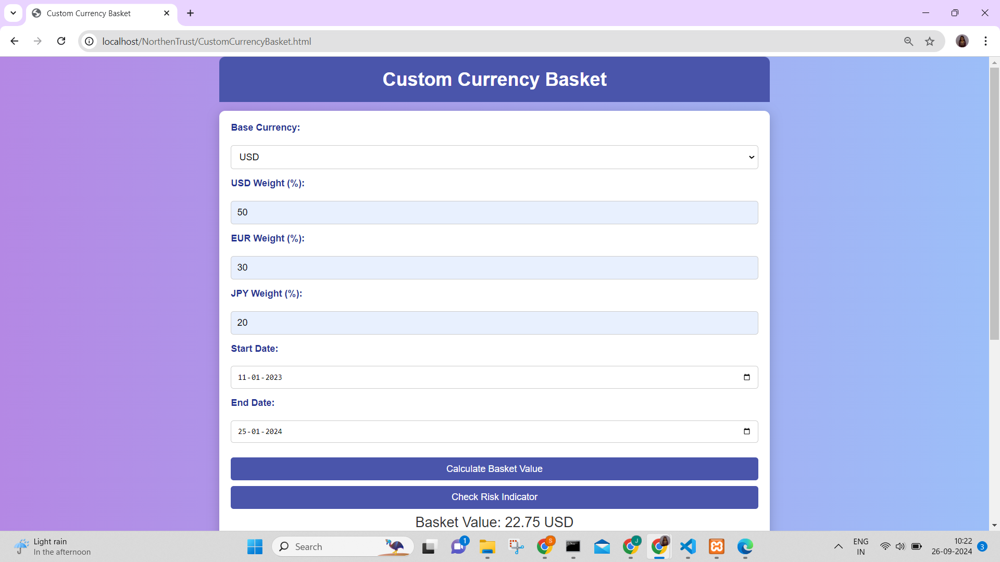
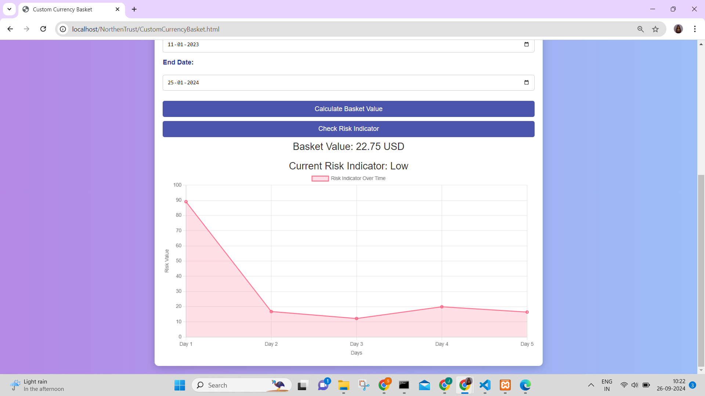

<!DOCTYPE html>
<html lang="en">
<head>
    <meta charset="UTF-8">
    <meta name="viewport" content="width=device-width, initial-scale=1.0">
    
</head>
<body>

<h1>Currency Exchange Rate Dashboard</h1>

<h2>Table of Contents</h2>
<ul>
    <li><a href="#introduction">Introduction</a></li>
    <li><a href="#features">Features</a></li>
    <li><a href="#installation">Installation</a></li>
    <li><a href="#configuration">Configuration</a></li>
    <li><a href="#conclusion">Conclusion</a></li>
</ul>

<h2 id="introduction">Introduction</h2>

    The Currency Exchange Rate Dashboard is a web application designed to help users analyze exchange rates between two currencies over various periods. Using USD as the base currency, the dashboard allows users to explore different currency pairs such as USD/INR, USD/GBP, USD/EUR, and USD/CAD. The application provides insights into historical exchange rate trends, allowing users to make informed decisions based on the data.

<h2 id="features">Features</h2>
<ul>
    <li>Analyze exchange rates between USD and selected currencies.</li>
    <li>Options to display charts for weekly, monthly, quarterly, and yearly intervals.</li>
    <li>Highlight the date when the exchange rate reached its highest and lowest points.</li>
    <li>Print the exchange rate data in a chart format.</li>
    <li>User-friendly interface for seamless navigation.</li>
    <li>Screenshots of the project:</li>
</ul>

<h2 id="installation">Installation</h2>

To run this project locally, follow these steps:

<ol>
    <li>Clone the repository:
         <code>git clone https://github.com/yourusername/currency-exchange-rate-dashboard.git</code>
    </li>
    <li>Navigate to the project directory:
         <code>cd currency-exchange-rate-dashboard</code>
    </li>
    <li>Install the required dependencies. If using Flask, you might need to set up a virtual environment:
         <code>python -m venv venv</code>
         <code>source venv/bin/activate  # For Linux/Mac</code>
         <code>venv\Scripts\activate     # For Windows</code>
         <code>pip install -r requirements.txt</code>
    </li>
</ol>

<h2 id="configuration">Configuration</h2>
<ol>
    <li>Ensure you have the currency exchange rate dataset file ready. The dataset should include exchange rates for the currency pairs you want to analyze.</li>
    <li>Configure the API key if you are using an external API to fetch exchange rates. Replace the placeholder with your actual API key in the appropriate configuration file.</li>
    <li>Run the application:
         <code>flask run</code>
    </li>
    <li>Access the dashboard by navigating to <code>http://127.0.0.1:5000</code> in your web browser.</li>
</ol>

<h2 id="conclusion">Conclusion</h2>

    The Currency Exchange Rate Dashboard is an essential tool for users interested in tracking and analyzing currency exchange rates. By providing comprehensive data visualization options and user-friendly functionality, this project aims to simplify the process of currency analysis.

    Feel free to contribute to this project by submitting issues or pull requests!

</body>
</html>
